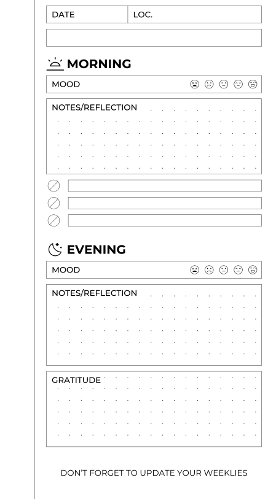
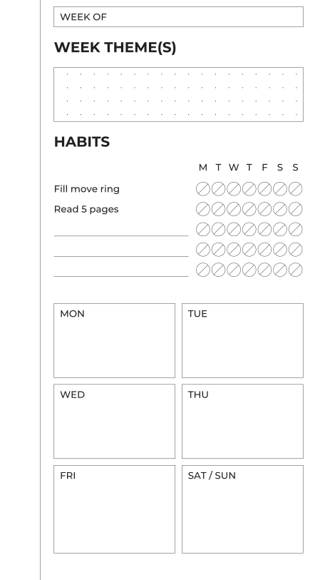
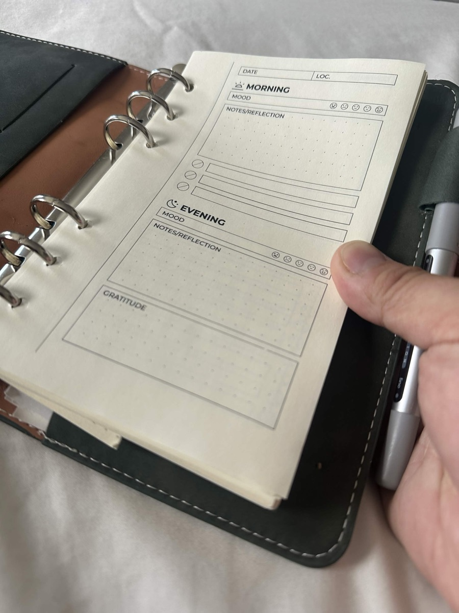
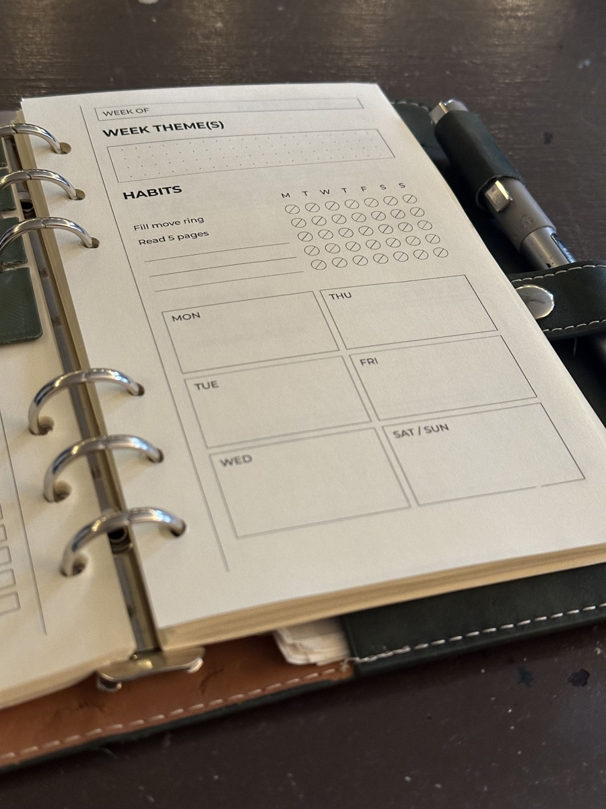

# journalkit

journalkit turns a YAML description of a journal page into print-ready SVG
and PDF. You list the modules a page should have — a date field, a heading,
a dotted box, a checklist — and it lays them out on a grid.

```sh
pipx install https://github.com/harrislapiroff/journalkit/archive/refs/heads/main.tar.gz
journalkit init my-journal && cd my-journal
journalkit build --pdf
```

<figure class="pair" markdown>
{ .page width="300" }
{ .page width="300" }
<figcaption>Two pages from the example project, rendered to PNG.</figcaption>
</figure>

<figure class="pair" markdown>
{ width="300" }
{ width="300" }
<figcaption>The same pages printed, trimmed and punched for a ring binder.</figcaption>
</figure>

## Where to start

- [Tutorial](tutorial/index.md): install, build the starter project, add a
  page, write a module. About twenty minutes.
- [Guides](guide/index.md): how to do particular things.
- [Reference](reference/index.md): every command, key and parameter.
- [Explanation](explanation/index.md): why it works the way it does.

## What a document looks like

```yaml title="templates/daily.yaml"
document: daily
page:
  size: [105, 170]
  margins: {top: 2.5, bottom: 7.5, inner: 15, outer: 5}
grid:
  module: 2.5
  dots: {spacing: 5, origin: [0, 2.5]}
templates:
  front:
    side: right
    content:
      - {type: fields, columns: [{label: DATE, width: 25}, {label: "LOC."}]}
      - {type: heading, text: MORNING, icon: sunrise}
      - {type: box, label: NOTES, height: fill, dots: true}
      - {type: checklist, rows: 3}
pages: [front]
```

A project is a directory with a `templates/` folder of files like this, and
optionally `modules/` for your own module types in Python and `icons/` for
your own SVG icons.

## Requirements

Python 3.10 or newer. PDF and PNG output use [Inkscape](https://inkscape.org),
and multi-page PDFs also use [Ghostscript](https://ghostscript.com); SVG
output needs neither.

BSD 3-Clause License.
