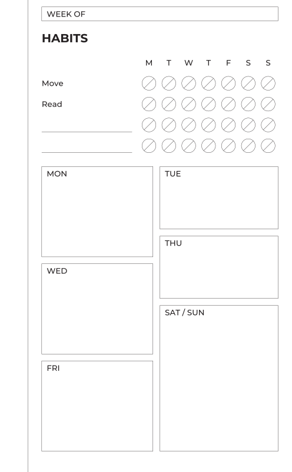
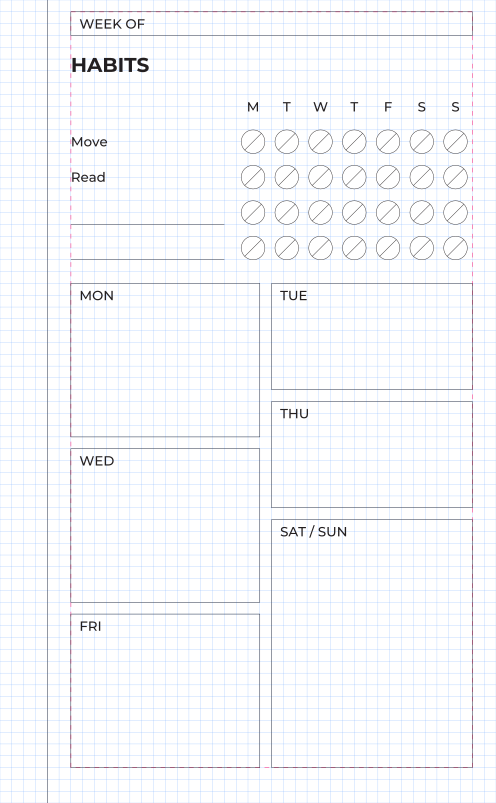
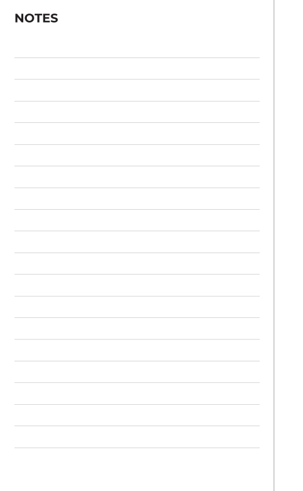

# Add a page

A weekly overview from scratch: a header, a habit tracker, two columns of
day boxes. Along the way: containers, `fill` weights, the debug overlay.

## Start a document

Create `templates/weekly.yaml`:

```yaml
document: weekly

page:
  size: [105, 170]
  margins: {top: 2.5, bottom: 7.5, inner: 15, outer: 5}

grid:
  module: 2.5
  dots: {spacing: 5, origin: [0, 2.5]}

decorations:
  - {type: rule, edge: inner, offset: 5}

templates:
  plan:
    side: right
    content:
      - type: fields
        columns: [{label: WEEK OF}]
pages: [plan]
```

Run `journalkit watch --png` in a second terminal. It rebuilds on every save,
so you can keep `out/weekly-01-plan.png` open in a viewer that reloads.

## A heading and a habit grid

Add to `content`:

```yaml
      - type: heading
        text: HABITS
      - type: habit_grid
        headers: [M, T, W, T, F, S, S]
        habits: [Move, Read, "", ""]
        label_width: 35
        row_height: 5
```

A blank habit gets a rule to write on. The grid works out its height from
the number of rows, so it needs no `height`.

## Two columns of days

`content` is a stack. For columns, nest a `row` with a `stack` in each:

```yaml
      - type: row
        height: fill
        gap: 5
        gap_between: 2.5
        content:
          - type: stack
            gap_between: 2.5
            content:
              - {type: box, label: MON, height: fill}
              - {type: box, label: WED, height: fill}
              - {type: box, label: FRI, height: fill}
          - type: stack
            gap_between: 2.5
            content:
              - {type: box, label: TUE, height: fill}
              - {type: box, label: THU, height: fill}
              - {type: box, label: "SAT / SUN", height: fill, flex: 2}
```

<figure class="pair" markdown>
{ .page width="300" }
{ .page width="300" }
<figcaption>The page, and the same page built with <code>--debug</code>.</figcaption>
</figure>

The row takes the remaining height and sits 5 mm below the habit grid
(`gap` is the space before a module). The two stacks split the width. Inside
each, the boxes split the height by `flex`: the weekend box has weight 2, so
it is twice the height of TUE and THU. Shares are rounded down to the grid
and the remainder goes to the last box, so the column ends exactly on the
margin.

To see the grid, build once with the overlay:

```sh
journalkit build templates/weekly.yaml --png --debug
```

Blue lines are the module grid, the pink dashed box is the content area.
Every module edge is on a blue line. `journalkit check` asserts the same
thing without drawing.

## The verso

Add a second template and page:

```yaml
templates:
  plan:
    # …
  notes:
    side: left
    content:
      - type: heading
        text: NOTES
      - type: lines
        height: fill
        spacing: 7.5
pages: [plan, notes]
```

<figure markdown>
{ .page width="300" }
<figcaption>The verso: binding margin and rule on the right.</figcaption>
</figure>

The rules are 7.5 mm apart, three grid steps, so they line up with anything
else on the page.

`journalkit build` with no arguments now renders both documents. Next:
[write a module](write-a-module.md).
