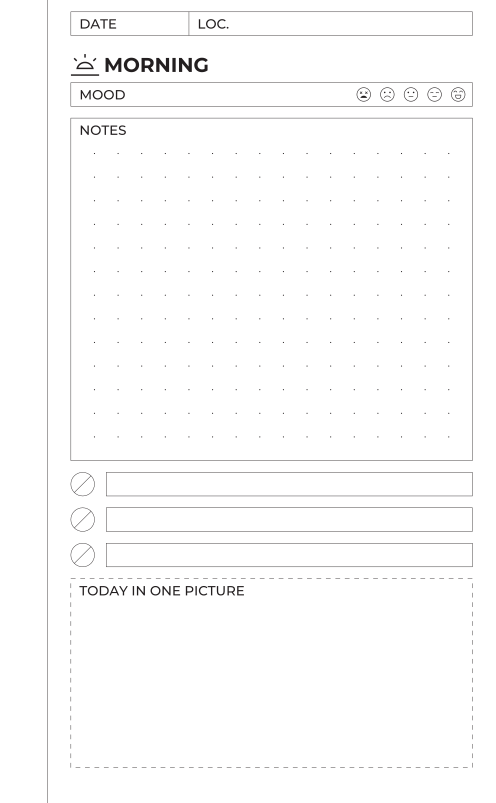
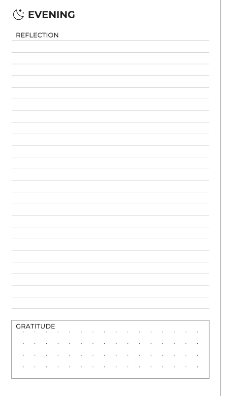

# Your first journal

## Scaffold a project

```sh
journalkit init my-journal
cd my-journal
```

```
wrote my-journal/README.md
wrote my-journal/modules/stamp.py
wrote my-journal/templates/daily.yaml

next: cd my-journal && journalkit build --png    # then open out/
```

`templates/daily.yaml` is a two-page document, `modules/stamp.py` is a small
module type it uses, and the README explains the layout. Only `templates/`
is required in a project.

## Build it

```sh
journalkit build --png
```

```
wrote /…/my-journal/out/daily-01-front.svg
wrote /…/my-journal/out/daily-02-back.svg
wrote /…/my-journal/out/daily-01-front.png
wrote /…/my-journal/out/daily-02-back.png
```

<figure markdown>
{ width="280" }
{ width="280" }
<figcaption>out/daily-01-front.png and out/daily-02-back.png</figcaption>
</figure>

The front is a recto: a date and location row, a heading with an icon, a
mood scale, a notes box that takes whatever height is left, three checklist
rows, and a dashed frame drawn by the `stamp` module. The back is a verso:
the wide binding margin and the rule beside it have moved to the right. The
template only says `side: left`; the margins mirror on their own.

## Read the template

Open `templates/daily.yaml`.

```yaml
document: daily            # (1)!

page:
  size: [105, 170]         # (2)!
  margins:
    top: 2.5
    bottom: 7.5
    inner: 15              # (3)!
    outer: 5

grid:
  module: 2.5              # (4)!
  dots:
    spacing: 5
    origin: [0, 2.5]

templates:
  front:
    side: right
    content:               # (5)!
      - type: fields
        columns: [{label: DATE, width: 25}, {label: "LOC."}]
      - type: heading
        text: MORNING
        icon: sunrise
      # …
pages:
  - template: front        # (6)!
  - template: back
```

1.  The name, used for output file names.
2.  Width and height in millimetres. Names like `a5` or `pocket` work too.
3.  `inner` is the binding side: the left margin on a recto, the right on a
    verso.
4.  Every module snaps to this grid. Dots are a separate, coarser lattice.
5.  A page is a stack of modules, top to bottom.
6.  The pages to render, in order.

Everything else is optional. The [document reference](../reference/document.md)
lists every key.

## Change something

In `front`, change the checklist from `rows: 3` to `rows: 6` and build
again. The checklist grew and the notes box shrank by the same amount,
because `height: fill` means whatever is left. The stack still ends on the
bottom margin.

Now give the notes box `height: 21`:

```
warning: daily: front: box: height 21.000mm is off the 2.500mm grid, snapped to 20.000mm
```

The build succeeded and the box is 20 mm. Warnings go to stderr with exit
code 0; `--strict` makes them errors. Put `fill` back.

## Make a PDF

```sh
journalkit build --pdf
journalkit check
```

`out/daily.pdf` is the printable document. `check` confirms that every
module landed on the grid and that the PDF contains no font substitutions:

```
== module grid ==
daily / front                   2.5mm   6 placements, 0 off-grid
daily / back                    2.5mm   3 placements, 0 off-grid

9 placements checked; all on the 2.5mm grid

== embedded fonts ==
daily.pdf                    text outlined, no fonts embedded

fonts ok
```

Text is drawn as outlines from a font bundled with journalkit, so the PDF
embeds no fonts and looks the same on any machine.

Next: [add a page](add-a-page.md).
