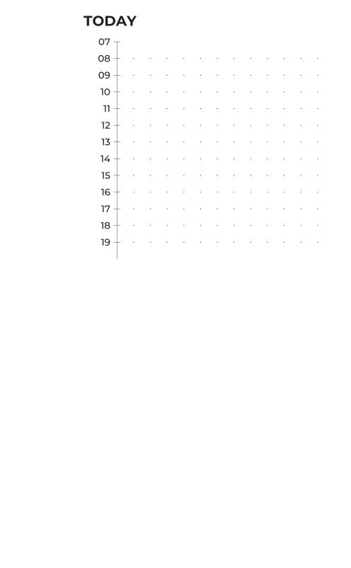

# Write a module

When the built-in modules don't draw what you want, a module is one Python
class in your project's `modules/` directory. This page writes a
**timeline**: hour marks down a vertical rule, with writing space beside
them.

## The shape of a module

`modules/stamp.py`, which `journalkit init` wrote, is the whole pattern:

```python
from journalkit.modules import Module, register

@register("stamp")
class Stamp(Module):
    """A dashed frame to stick a photo or a ticket in."""

    params = {"label": "text drawn in the corner"}

    def natural_height(self, width):
        return 40.0

    def draw(self, canvas, rect):
        canvas.rect(rect.x, rect.y, rect.w, rect.h, fill="none",
                    stroke=self.stroke, stroke_width=self.stroke_width,
                    stroke_dasharray=self.opt("dash", "1 1"))
        self.draw_label(canvas, rect)
        self.draw_dots(canvas, rect)
```

- `@register("stamp")` makes `type: stamp` available in YAML. Every `.py` in
  `modules/` is imported before a build.
- `params` is documentation for `journalkit modules`.
- `natural_height` is the height used when the template gives none. Return
  `None` for "no opinion", which behaves like `fill`.
- `draw` gets a `Canvas` and a `Rect`, already snapped to the grid, in page
  millimetres.

## The timeline

Create `modules/timeline.py`:

```python
"""A day plan: hour labels down a vertical rule, writing space to the right."""

from journalkit.modules import Module, register


@register("timeline")
class Timeline(Module):
    """Hour marks down the left edge with a writing area beside them."""

    params = {
        "start": "first hour (default 8)",
        "end": "last hour (default 20)",
        "gutter": "width of the hour-label gutter in mm (default 10)",
        "dots": "true to fill the writing area with the dot lattice",
    }

    def _hours(self):
        return range(int(self.opt("start", 8)), int(self.opt("end", 20)) + 1)

    def natural_height(self, width):
        # One grid step per hour keeps every mark on the lattice.
        return len(self._hours()) * self.ctx.grid * 2

    def draw(self, canvas, rect):
        gutter = self.length("gutter") or 10.0
        hours = list(self._hours())
        step = rect.h / len(hours)
        axis_x = rect.x + gutter

        canvas.line(axis_x, rect.y, axis_x, rect.bottom,
                    stroke=self.stroke, stroke_width=self.stroke_width)
        for index, hour in enumerate(hours):
            y = rect.y + index * step
            canvas.line(axis_x - 1.0, y, axis_x + 1.0, y,
                        stroke=self.stroke, stroke_width=self.stroke_width)
            # Baseline placed from the cap height, so the label centres on the tick.
            self.text(canvas, axis_x - 2.0, y + self.cap_height("label") / 2,
                      "%02d" % hour, style="label", text_anchor="end")

        if self.opt("dots"):
            from journalkit.geometry import Rect
            self.draw_dots(canvas, Rect(axis_x, rect.y, rect.right - axis_x, rect.h))
```

What it uses:

- `self.opt(key, default)` reads a YAML option; `self.length(key)` does the
  same and converts units to millimetres.
- `self.stroke` and `self.stroke_width` come from the theme unless the YAML
  overrides them.
- `self.text(...)` draws in the theme's `label` style. Placing the baseline
  at `y + cap_height / 2` centres a capital on `y`.
- `self.draw_dots(rect)` samples the page's dot lattice inside whatever rect
  you give it, so the dots line up with every other dotted module.
- `self.ctx.grid` is the module grid. Nothing forces your internal geometry
  onto it; the grid rule is about where the module is placed.

## Try it

```sh
journalkit modules | grep -A4 '^timeline'
```

```
timeline — Hour marks down the left edge with a writing area beside them.  [timeline.py]
      start          first hour (default 8)
      end            last hour (default 20)
      …
```

`preview` renders a snippet without a template file:

```sh
echo '- {type: heading, text: TODAY}
- {type: timeline, start: 7, end: 19, dots: true}' | journalkit preview
```

<figure markdown>
{ width="300" }
<figcaption>out/preview/preview-01-preview.png</figcaption>
</figure>

Then use it in a template like any other module. With `height: fill` the
hour spacing stretches to fit; without it, `natural_height` decides.

The [custom modules guide](../guide/custom-modules.md) lists the rest of the
`Module` API.
